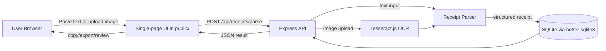

# Receipt Relay

Receipt Relay is a finance-lite MVP that lets you paste receipt text or upload a receipt image and receive a clean structured breakdown: merchant, date, line items, subtotal, tax, tip, total, currency, confidence, and raw OCR/text.

## Architecture



## What works in this MVP

- Paste raw receipt text and parse it immediately.
- Upload common image types (`png`, `jpg`, `jpeg`, `webp`) and run local OCR via Tesseract.js.
- Detect merchant, date, currency, subtotal, tax, tip, total, and line items.
- Save parsed receipts to SQLite.
- View structured results, copy JSON, and download CSV line items.

Parsing uses deterministic receipt heuristics. It is designed for typical printed receipts and works best when receipt text has item names followed by prices and explicit total/tax/subtotal labels.

## Requirements

- Node.js 20+
- npm

No paid external services or API keys are required.

## Run locally

```bash
cd brain-receipt-relay
cp .env.example .env
npm install
npm run dev
```

Open http://localhost:3000

## Smoke test

With dependencies installed:

```bash
npm run smoke
```

This runs the parser against a sample receipt and prints structured JSON.

## Environment variables

| Variable | Default | Description |
| --- | --- | --- |
| `PORT` | `3000` | HTTP port for the Express server. |
| `DATABASE_PATH` | `./data/receipts.db` | SQLite database file path. Created automatically. |
| `OCR_LANG` | `eng` | Tesseract language code used for OCR image uploads. |
| `MAX_UPLOAD_MB` | `8` | Maximum upload size in megabytes. |

## API

### `POST /api/receipts/parse`

Accepts either JSON text:

```json
{ "text": "ACME MARKET\n2025-01-03\nMilk 3.99\nSubtotal 3.99\nTax 0.33\nTotal 4.32" }
```

or multipart form data with an `image` file and/or `text` field.

Returns:

```json
{
  "receipt": {
    "id": "...",
    "createdAt": "...",
    "sourceType": "text",
    "merchant": "ACME MARKET",
    "date": "2025-01-03",
    "currency": "USD",
    "subtotal": 3.99,
    "tax": 0.33,
    "tip": 0,
    "total": 4.32,
    "rawText": "...",
    "lineItems": [{ "name": "Milk", "qty": 1, "unitPrice": 3.99, "amount": 3.99 }],
    "confidence": 0.82
  }
}
```
